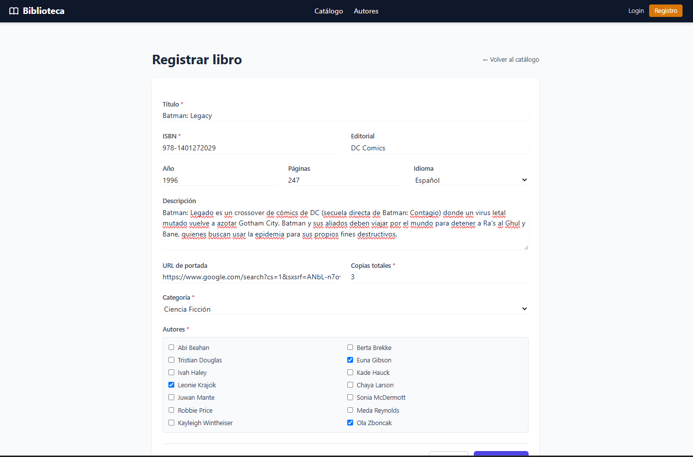
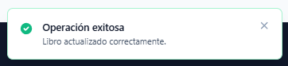
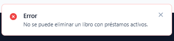
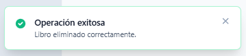
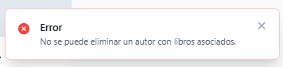
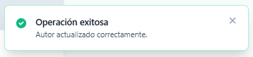
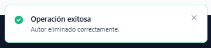

## Guía 7 - CRUD Completo con Formularios

En esta versión se completó el CRUD de libros y autores, incorporando formularios de creación y edición, validaciones de datos, mensajes flash, eliminación lógica mediante Soft Deletes, verificaciones de integridad referencial y reutilización de código mediante partials Blade.

### Registro de un libro

<p align="center">
  
</p>

### Editar un libro

<p align="center">
  
</p>

### Error al eliminar un libro con préstamos activos

<p align="center">
  
</p>

### Eliminar un libro

<p align="center">
  
</p>

### Error al eliminar un autor con libros asociados

<p align="center">
  
</p>

### Editar un autor

<p align="center">
  
</p>

### Eliminar un autor

<p align="center">
  
</p>

## Guía de Instalación

### 1. Clonar el Repositorio

```bash
git clone https://github.com/svvxyz/INF560-library-app.git
cd INF560-library-app
```

### 2. Crear la Base de Datos y Asignar Permisos en PostgreSQL

```bash
psql -U postgres
```

Dentro de PostgreSQL:

```sql
CREATE DATABASE library_app_db OWNER nombre_usuario;
GRANT ALL PRIVILEGES ON DATABASE library_app_db TO nombre_usuario;
```

### 3. Configurar Variables de Entorno

```bash
cp .env.example .env
```

Edita `.env` con tus credenciales:

```env
DB_DATABASE=library_app_db
DB_USERNAME=nombre_usuario
DB_PASSWORD=tu_password
```

### 4. Instalar Dependencias PHP

```bash
composer install
```

### 5. Generar Clave de Aplicación

```bash
php artisan key:generate
```

### 6. Ejecutar Migraciones y Seeders

```bash
php artisan migrate --seed
```

### 7. Instalar Dependencias Frontend

Instalar las dependencias de Node.js y Alpine.js:

```bash
npm install
npm install alpinejs
```

Verificar que `resources/js/app.js` contenga:

```js
import './bootstrap';

import Alpine from 'alpinejs';

window.Alpine = Alpine;

Alpine.start();
```

Compilar los recursos frontend:

```bash
npm run dev
```

### 8. Iniciar el Servidor

```bash
php artisan serve
```

La aplicación estará disponible en:

```txt
http://127.0.0.1:8000
```